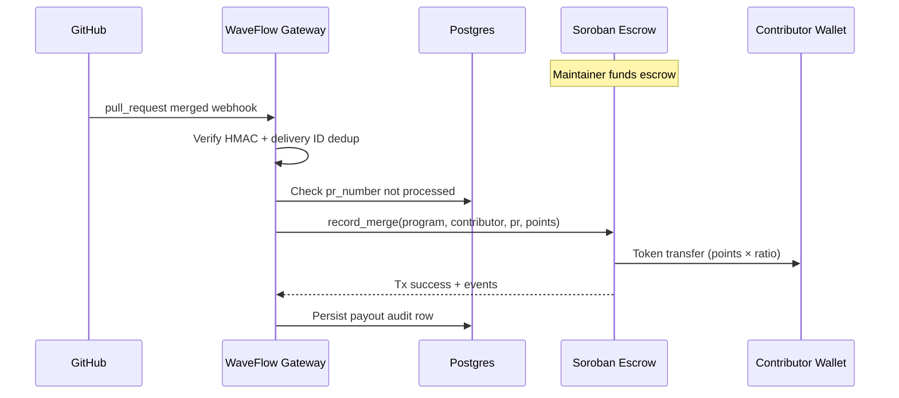

# WaveFlow — Product Requirements Document

**Version:** 0.2  
**Status:** Production target  
**Repository:** [github.com/StellarRoute/WaveFlow](https://github.com/StellarRoute/WaveFlow)

---

## 1. Problem Statement

Open-source bounty programs on Stellar today lack a **ledger-native, automated payout pipeline** tied to verifiable contribution events (e.g. merged GitHub pull requests).

[Drips Wave](https://www.drips.network/wave) demonstrates a proven model: maintainers define reward pools, contributors earn points from merged PRs, and payouts flow automatically from a synced off-chain pipeline. That model is powerful but **not anchored on Stellar/Soroban**. Maintainers who want transparent, programmable, wallet-direct rewards must either:

- run manual treasury ops (slow, error-prone, unauditable), or
- rely on centralized payout rails disconnected from Stellar assets.

**WaveFlow** solves this by implementing the Wave mechanics **on-chain**: maintainers lock Stellar assets in a Soroban escrow contract; a verified GitHub merge event triggers an authorized gateway attestation; the contract computes reward from a configurable point-to-token ratio and pays the contributor's Stellar wallet immediately.

Core pain: **no trust-minimized, automated, Stellar-native bounty escrow with GitHub-verified triggers.**

---

## 2. Target Users

| Persona | Context | Primary need |
|---------|---------|--------------|
| **Program maintainer** | OSS repo owner or ecosystem grant operator funding Wave-style sprints | Lock funds, set point economics, link GitHub repo, monitor payouts without manual transfers |
| **Contributor** | Developer merging PRs into a registered repo | Register Stellar wallet, earn on merge, see payout status on-chain |
| **Gateway operator** | StellarRoute-style infra team running the attestation service | Secure webhook ingestion, idempotent attestations, observability |
| **Integrator / auditor** | Wallet, explorer, or compliance reviewer | Read-only API + on-chain events for program state and payout history |

**Assumed context:** Users are familiar with Stellar wallets (Freighter, etc.) and GitHub PR workflows. WaveFlow does not replace GitHub; it **reacts** to merge events. Drips Wave-style sprints assume **top-tier open-source contributors** implementing and reviewing production-grade code, not scaffold tolerance.

---

## 3. Quality Bar and Contributor Expectations

### Production-grade definition

WaveFlow v1 is **production-limited** (testnet or mainnet-limited launch), not a prototype. Every production path must be:

| Principle | Requirement |
|-----------|-------------|
| **Security-first** | Fail closed on auth, signature, and idempotency violations; no trust in unverified webhook payloads |
| **Observable** | Structured logs, Prometheus metrics, health/readiness endpoints, correlation IDs on all requests |
| **Deployable** | Render-compatible services (`render.yaml`), Docker images, env-driven config, no hardcoded secrets |
| **Auditable** | Postgres audit trail for webhooks, attestations, and payouts; on-chain events match off-chain records |
| **Idempotent** | Same PR, webhook delivery, or attestation cannot cause double payout |
| **Fail-closed** | Insufficient escrow, paused program, invalid contributor, or chain submission failure blocks payout; no silent partial success |

### Expectations for top-tier contributors

Contributors participating in Drips Wave-style sprints on WaveFlow must:

- Ship **small, focused PRs** with a clear scope tied to a feature ID (F1–F7) or launch-gate item
- Meet **all acceptance criteria** in this PRD for the touched feature; partial implementation is not mergeable
- Avoid **placeholder implementations in production paths** (no `todo!()`, simulated tx hashes, or stub RPC clients behind non-dev flags in prod builds)
- Use **structured error handling** (`crates/shared/src/error.rs` patterns); propagate context without leaking secrets
- Update **docs with behavior changes** (`docs/`, `AGENTS.md`, runbooks) when API, env vars, or operational behavior changes
- Include **tests** that prove idempotency, auth rejection, and failure modes for changed code paths

### Code review bar

Reviewers reject PRs that:

| Violation | Standard |
|-----------|----------|
| Simulated chain submission in production | Gateway must submit real Soroban transactions via `SOROBAN_RPC_URL`; dry-run or fake hashes allowed only in unit/integration tests |
| Secrets in logs | No webhook secrets, admin keys, or `GATEWAY_SECRET_KEY` material in log output |
| Backward-unsafe migrations | Postgres migrations under `migrations/` must be additive or explicitly documented with rollback steps |
| Unauthenticated mutating API routes | All POST/PUT/PATCH/DELETE on `crates/api/src/routes/admin.rs` require valid `API_ADMIN_KEYS` |
| Missing observability on new failure paths | New error branches must increment metrics or emit structured log fields documented in the runbook |

---

## 4. Goals and Non-Goals

### Goals

| ID | Goal | Success signal |
|----|------|----------------|
| G1 | Ledger-native escrow for bounty pools (XLM or Soroban tokens) | Maintainer deposits; balance visible on-chain and mirrored in Postgres |
| G2 | GitHub merge → attestation → payout in one automated loop | Merged PR triggers payout without manual signer intervention |
| G3 | Configurable point-to-reward economics per program | Maintainer sets ratio; contract computes `points × ratio` |
| G4 | Idempotent, replay-safe attestations | Same PR cannot pay twice (Postgres unique constraint + on-chain `ProcessedPr`) |
| G5 | Operable gateway + API mirroring StellarRoute backend patterns | Health/readiness checks, structured logs, Postgres audit trail, Prometheus metrics |
| G6 | Production SLOs for gateway availability | 99.5% uptime for webhook ingestion endpoint over 30-day window; documented in maintainer runbook |
| G7 | Complete audit trail for compliance review | Every payout row links to webhook delivery ID, attestation attempt, Soroban tx hash, and ledger sequence |
| G8 | Mainnet-ready contract patterns | TTL extension on deploy, event emission for all state changes, upgrade path documented in `docs/` |

### Non-Goals (v1)

These remain **out of v1 scope**. v1 itself is still production-grade and production-limited (testnet or mainnet-limited launch), not an MVP scaffold.

| ID | Non-goal | Rationale |
|----|----------|-----------|
| NG1 | Full Drips/Wave product parity (leaderboards, social, multi-tenant SaaS UI) | Scope: escrow + payout engine only |
| NG2 | On-chain GitHub light client / ZK proof of merge | Use authorized gateway attestation (oracle model) |
| NG3 | Streaming payments (e.g. continuous DCA) | Immediate discrete payouts per merge event |
| NG4 | Multi-chain or non-Stellar assets | Stellar/Soroban only |
| NG5 | Dispute resolution / clawback governance UI | Future phase; v1 supports maintainer pause only |
| NG6 | Replacing StellarRoute DEX aggregation | Separate product; may share infra patterns only |

---

## 5. Core Features

### F1 — Program creation and escrow funding

**Description:** Maintainer creates a bounty program linked to a GitHub repo (`owner/name`), sets point reward ratio, and deposits tokens into escrow.

| Acceptance criterion | Given | When | Then |
|---------------------|-------|------|------|
| AC-F1.1 | Maintainer has approved token allowance | `create_program` + `fund` called via admin API or CLI | Escrow balance increases on-chain; `ProgramCreated` event emitted; Postgres `programs` row created with matching `on_chain_program_id` |
| AC-F1.2 | Deposit below minimum | `fund` with zero amount | Transaction reverts with `InsufficientDeposit`; API returns 400 with structured error body |
| AC-F1.3 | Invalid repo string | `create_program` with malformed repo | Transaction reverts with `InvalidRepo`; API validates slug format before chain submission |
| AC-F1.4 | Production deployment | Maintainer funds program on target network | Real Soroban tx hash persisted; no simulated or placeholder hash in Postgres `payouts` or program audit rows |
| AC-F1.5 | Token contract verification | `fund` with unverified token address | Admin API rejects or documents explicit maintainer acknowledgment; address stored for audit |

### F2 — Contributor registration

**Description:** Contributors map GitHub username to Stellar address for a program.

| Acceptance criterion | Given | When | Then |
|---------------------|-------|------|------|
| AC-F2.1 | Unregistered contributor | Maintainer calls authenticated `register_contributor` | Mapping stored on-chain and in Postgres `contributors`; event emitted |
| AC-F2.2 | Duplicate registration same username | Second register with different address | Reverts with `ContributorAlreadyRegistered` |
| AC-F2.3 | Unregistered contributor at payout | Merge attestation arrives | Gateway rejects before chain tx; audit log records `contributor_not_found`; metric incremented |
| AC-F2.4 | Invalid Stellar address | Register with malformed address | API returns 400 before chain submission; no partial DB write |

### F3 — GitHub merge attestation (gateway)

**Description:** Gateway receives GitHub `pull_request` closed+merged webhooks, verifies HMAC, resolves contributor, submits on-chain attestation.

| Acceptance criterion | Given | When | Then |
|---------------------|-------|------|------|
| AC-F3.1 | Valid webhook for registered repo/program | PR merged to default branch | Gateway submits real `record_merge` via Soroban RPC; payout executes; tx hash stored |
| AC-F3.2 | Invalid HMAC | Webhook with bad signature | HTTP 401; no chain tx; raw payload persisted in `webhook_events` with `status = rejected` |
| AC-F3.3 | PR not merged | `closed` without merge | Ignored; no attestation; audit row with `status = ignored` |
| AC-F3.4 | Duplicate PR number | Replay webhook or duplicate delivery | Gateway or contract rejects; no double payout; HTTP 200 on replay (idempotent ack) after first success |
| AC-F3.5 | Duplicate GitHub delivery ID | Same `X-GitHub-Delivery` replayed | Dedup via `webhook_events.delivery_id` unique constraint; no second chain submission |
| AC-F3.6 | Rate limit exceeded | Burst of webhooks from single IP or repo | HTTP 429 after configured threshold; no chain tx until window resets |
| AC-F3.7 | Production path | Successful attestation | Soroban tx hash is verifiable on target network explorer; not a dry-run or mock hash |

### F4 — Point-to-reward calculation and payout

**Description:** Contract computes payout as `points × reward_per_point` and transfers tokens to contributor wallet.

| Acceptance criterion | Given | When | Then |
|---------------------|-------|------|------|
| AC-F4.1 | Escrow sufficient; contributor registered | `record_merge(points=N)` | Contributor receives `N × ratio` tokens; `PayoutExecuted` event emitted |
| AC-F4.2 | Escrow insufficient | Payout exceeds balance | Reverts `InsufficientEscrow`; gateway surfaces alert; Postgres records failed attempt |
| AC-F4.3 | Program paused | Attestation submitted | Reverts `ProgramPaused`; gateway does not retry without maintainer action |
| AC-F4.4 | Audit completeness | Successful payout | Postgres `payouts` row includes `tx_hash`, `pr_number`, `amount`, `github_username`, `stellar_address`, and timestamp |

### F5 — Program administration

**Description:** Maintainer can pause/resume program, adjust ratio (with bounds), and withdraw unallocated escrow when paused.

| Acceptance criterion | Given | When | Then |
|---------------------|-------|------|------|
| AC-F5.1 | Active program | Maintainer calls authenticated `pause` | Further attestations rejected on-chain |
| AC-F5.2 | Paused program with remaining balance | Maintainer calls authenticated `withdraw_remaining` | Remaining escrow returned to maintainer; event emitted |
| AC-F5.3 | Non-maintainer or missing admin key | Calls admin function via API or chain | Reverts `Unauthorized` or API 401/403 |
| AC-F5.4 | All mutating admin routes | POST/PUT/PATCH/DELETE on admin API | Require valid `X-API-Key` matching `API_ADMIN_KEYS`; unauthenticated requests return 401 |

### F6 — Audit API and observability

**Description:** REST API exposes program status, payout history (from Postgres), health/readiness endpoints, and Prometheus metrics.

| Acceptance criterion | Given | When | Then |
|---------------------|-------|------|------|
| AC-F6.1 | Gateway processed merge | GET `/api/v1/programs/:id/payouts` | Returns payout record with real tx hash, PR number, amount, and timestamps |
| AC-F6.2 | Service healthy | GET `/health` | 200 with DB connectivity status |
| AC-F6.3 | Service ready | GET `/ready` (or readiness section of `/health`) | 200 only when DB pool and required config are initialized |
| AC-F6.4 | Authenticated admin | POST with invalid API key | 401 |
| AC-F6.5 | Metrics scrape | GET `/metrics` on gateway and API | Prometheus text format; includes webhook, attestation, and payout counters |
| AC-F6.6 | Request tracing | Any API request | Response includes correlation/request ID in logs (TraceLayer on API) |

### F7 — Milestone budgets (optional cap per epoch)

**Description:** Programs may define a milestone window (ledger sequence or timestamp) with max payout cap.

| Acceptance criterion | Given | When | Then |
|---------------------|-------|------|------|
| AC-F7.1 | Milestone cap reached | Additional merge attestation | Reverts `MilestoneCapExceeded`; gateway records failure; alert threshold documented |
| AC-F7.2 | Milestone active | Payout within cap | Succeeds; milestone spent counter updated on-chain and in Postgres |

---

## 6. Technical Constraints

| Area | Constraint |
|------|------------|
| **Smart contracts** | Rust, Soroban SDK 21.x, `no_std`, WASM target; contract at `contracts/waveflow-escrow/` |
| **Gateway + API** | Rust (Tokio, Axum); gateway at `crates/gateway/`, API at `crates/api/`; shared types in `crates/shared/` |
| **Persistence** | Postgres for audit/idempotency (`migrations/001_init.sql`); optional Redis for rate limits |
| **Stellar network** | Testnet or mainnet-limited launch; mainnet-ready contract patterns (TTL extension, events) required regardless of target network |
| **GitHub integration** | Webhooks (`pull_request` events), HMAC-SHA256 verification (`crates/gateway/src/webhook.rs`), repo slug `owner/name` |
| **Oracle model** | Single authorized gateway address per deployment; multisig upgrade path deferred but documented |
| **Assets** | Native XLM and Soroban token contracts (SEP-41 style transfers) |
| **Deployment** | Docker Compose locally (`docker-compose.yml`); Render Blueprint (`render.yaml`); bind `0.0.0.0:$PORT` |
| **CI** | `cargo fmt`, `clippy -D warnings`, contract unit tests (`contracts/waveflow-escrow/src/test.rs`), gateway integration tests |
| **Secrets** | `DATABASE_URL`, `GITHUB_WEBHOOK_SECRET`, `SOROBAN_RPC_URL`, `GATEWAY_SECRET_KEY`, `API_ADMIN_KEYS` via env; production uses secrets manager, not plain files |
| **Idempotency** | Unique constraint on `(program_id, pr_number)` in Postgres; unique `delivery_id` on `webhook_events`; on-chain `ProcessedPr` storage |

### Production requirements (v1)

| Area | Requirement |
|------|-------------|
| **TLS termination** | HTTPS at load balancer or Render edge; no plain HTTP webhook endpoints in production |
| **Secrets management** | Render sync-false env vars or external secrets manager; rotation procedures documented |
| **Structured logging** | JSON or key-value logs with request ID, program ID, PR number, delivery ID; no secret values |
| **Metrics and alerts** | Prometheus `/metrics` on gateway and API; alert thresholds documented (see `docs/security-checklist.md`) |
| **Render deployment** | `render.yaml` defines gateway, API, and Postgres; health checks on `/health` |
| **Contract TTL** | Deploy script (`scripts/deploy-contract.sh`) extends instance TTL; documented in runbook |
| **Upgrade path** | Contract upgrade or migration strategy documented before mainnet-limited launch |
| **Migrations** | Backward-safe, additive changes preferred; breaking migrations require explicit rollout plan |
| **Rate limiting** | Public webhook and read endpoints rate-limited; configurable via env or middleware (`crates/api/src/middleware.rs`) |

**Environment assumptions:**

- Gateway has funded Stellar key for transaction submission fees.
- Maintainers interact via CLI/SDK or future UI; v1 includes production API + contract client examples.
- GitHub delivers webhooks to a public HTTPS endpoint (ngrok acceptable in dev only).
- Production builds set `RUST_LOG` and network env vars explicitly; no implicit testnet fallback when `SOROBAN_RPC_URL` points to mainnet.

---

## 7. Production Readiness Criteria (v1 launch gate)

All items must pass before a **production-limited** launch (testnet or mainnet-limited). Tracked as launch gate checklist.

| # | Criterion | Verification |
|---|-----------|--------------|
| PR-1 | Real Soroban RPC submission | No simulated hashes in prod; gateway submits via `SOROBAN_RPC_URL`; tx hashes verifiable on network explorer |
| PR-2 | Webhook HMAC + delivery ID dedup | `X-Hub-Signature-256` enforced; `X-GitHub-Delivery` dedup in `webhook_events` |
| PR-3 | Postgres audit trail complete | Webhook, attestation attempt, and payout rows linked; no orphan successful payouts |
| PR-4 | Health and readiness endpoints | `/health` and readiness signal on gateway and API; Render health checks passing |
| PR-5 | Prometheus metrics + alert thresholds | `/metrics` scraped; thresholds documented (e.g. `waveflow_gateway_webhook_failed_total`) |
| PR-6 | Security checklist executed | All items in `docs/security-checklist.md` checked for target environment |
| PR-7 | Maintainer runbook published | Operational procedures in `docs/` (deploy, rotate keys, pause program, incident response) |
| PR-8 | Contract deployed and verified | Escrow WASM deployed via `scripts/deploy-contract.sh`; `ESCROW_CONTRACT_ID` set; TTL extended |

---

## 8. Operational Requirements

### Escrow low-balance alerting

- Monitor on-chain escrow balance vs. projected payout liability (active contributors × expected merges × ratio)
- Alert maintainer and gateway operator when balance falls below configurable threshold (e.g. 7 days of expected payouts)
- Surface `InsufficientEscrow` failures as high-severity alerts, not only logs

### Failed attestation retry policy

| Parameter | Policy |
|-----------|--------|
| **Retriable errors** | Transient RPC errors, network timeout, fee bump needed |
| **Non-retriable errors** | `InsufficientEscrow`, `ProgramPaused`, `ContributorAlreadyRegistered` payout path, invalid contributor |
| **Max attempts** | 5 attempts with exponential backoff (e.g. 1m, 2m, 4m, 8m, 16m) |
| **Double-pay prevention** | Check Postgres `(program_id, pr_number)` and on-chain state before each retry; idempotent ack to GitHub after first on-chain success |
| **Dead letter** | After max attempts, mark attestation failed in audit table; manual replay requires operator action |

### Gateway key rotation procedure

1. Generate new Stellar key; fund for fees
2. Update contract authorized gateway address (maintainer/admin action)
3. Deploy new `GATEWAY_SECRET_KEY` to secrets manager
4. Rolling restart gateway service on Render
5. Revoke or drain old key; verify metrics show successful submissions from new key
6. Document rotation date in runbook

### Incident response

| Scenario | Action |
|----------|--------|
| Suspected webhook forgery or key compromise | Pause affected programs on-chain; rotate `GITHUB_WEBHOOK_SECRET` and `GATEWAY_SECRET_KEY`; review `webhook_events` audit |
| Runaway payouts or bug in attestation logic | Maintainer calls `pause` on affected programs; stop gateway processing via feature flag or service scale-to-zero |
| Webhook queue backlog | Drain or replay from `webhook_events` after fix; replays must respect delivery ID and PR idempotency |
| Database unavailable | Gateway fails closed (no chain tx without audit write); readiness endpoint returns not ready |

---

## 9. Open Questions

| # | Question | Impact | Status / default for production v1 |
|---|----------|--------|-------------------------------------|
| OQ1 | **Points source:** fixed points per merge vs. label/size-based scoring? | Gateway logic + contract args | **Decided:** fixed `1 point per merged PR` in v1 |
| OQ2 | **Who registers contributors:** maintainer-only vs. self-serve with GitHub OAuth? | API auth design | **Decided:** maintainer registers via authenticated admin API; self-serve in v2 |
| OQ3 | **Gateway decentralization:** single operator vs. multisig oracle set? | Contract admin model | **Decided:** single authorized gateway address; rotation procedure in Section 8 |
| OQ4 | **Token allowlist:** any Soroban token vs. curated list? | Security / scam risk | **Decided:** any token; maintainer bears risk; address verification in AC-F1.5 |
| OQ5 | **Testnet vs. mainnet launch target?** | Deployment config, `render.yaml`, RPC URLs | **Open:** default testnet for first production-limited launch; mainnet-limited requires PR-8 on mainnet and separate runbook |
| OQ6 | **Relationship to Drips Wave:** complementary tooling vs. official integration? | Product positioning | **Decided:** independent Stellar-native implementation; no Drips API dependency in v1 |
| OQ7 | **Partial payouts when escrow low:** fail vs. pay partial? | Contract behavior | **Decided:** fail closed (revert); alert maintainer per Operational Requirements |
| OQ8 | **PR base branch filtering:** default branch only vs. configurable? | Webhook filter | **Decided:** default branch only in v1 |
| OQ9 | **Mainnet-limited scope:** single program pilot vs. multi-program from day one? | Capacity planning, alerting | **Open:** recommend single-program pilot until PR-1 through PR-8 validated on mainnet |
| OQ10 | **Redis for rate limiting:** required at launch or Postgres-only fallback? | Infra complexity | **Open:** optional Redis; in-memory or Postgres-backed limit acceptable for production-limited v1 if documented |

---

## Appendix — Reference flow

